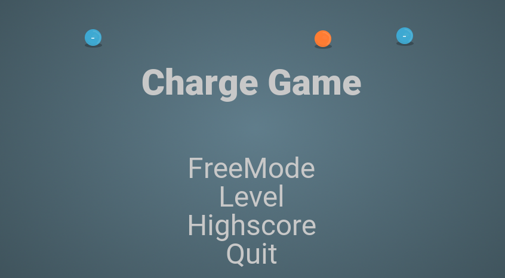
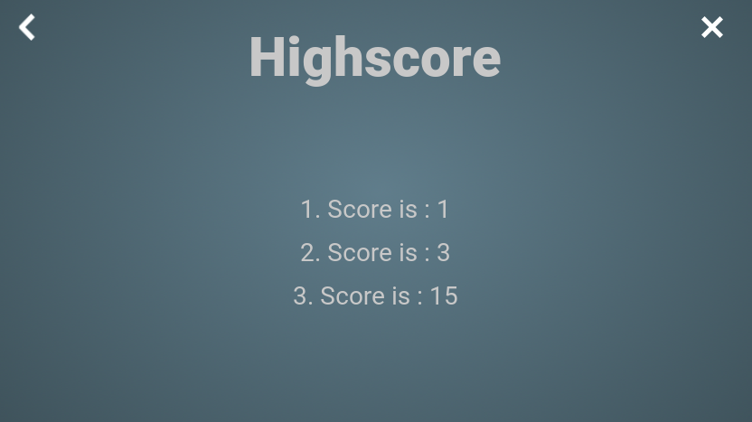

# Charge Game

[TOC]

<div style="page-break-after: always;"></div>

## Introduction

Charge game with SDL2.

This program create a particle that can be attracted or repulse from multiples charges. The player need to place others charges to make the moving particle arrive at a certain point. The player can retry multiple time. The goal is to suceed the level in the less try as possible. The 3 best scores are keep in a file and can be display in the highscore file. The level can also be created in a level editor, save and load.

Github can be found [here](https://github.com/OlivierLDff/hw1-chargegame).

## Specification

The game is divided into different screen with such hierarchy:

* Main menu
  * Free mode (which is kind of a level editor)
  * Play level
    * Win screen
  * Highscore
  * Quit

Every element present in the software can be considered as on object. This can be done in c thanks to structure union. So all buttons, particles, charges, text are based on the same structure `UBase_t`. The union is `UObject_t`. So all object render are UObject. With such a pattern all the object are put inside a **dynamic array** to keep track of all of them.

Every Object own this properties:

* **Object Type** : which kind a structure it is.


* **x** : position on the x axis in pourcent between 0 and 100
* **y** : position on the y axis in pourcent between 0 and 100
* **w** : width of the object, can't be used to render sprite but this is for texts
* **h** : height of the object, can't be used to render sprite but this is for texts
* **overlayed** : is the mouse over the object hit box
  * This flag is often use to highlight the element when rendering.
* **can be moved or delete** : this property is set on the object depending on player right and the part of the gmae

<div style="page-break-after: always;"></div>

### Main menu



The main menu have 4 buttons that lead to the others parts of the game. Free mode is the level editor part. Level allow you to play the level saved. And highscore let you see the 3 best scores. The quit button simply quit the application.

When the menu is loaded, a map called *menumap.dat* is also loaded to play the animation.

#### Available commands

* **Escape** keyboard quit the game

<div style="page-break-after: always;"></div>

### Free mode


The free mode allow the user to place where is want gameplay element to create a map.

#### Gameplay element

##### Main Particle

This is the main particle that is affected by all of the charges in the level. When the game is freeze it isn't affected by charges attractions or repulsions. It can only be present once in the map.


###### Implementation

This object behave as a singleton and this behavior is ensure with the called of `p_create` to create it each time. The type of the particle is `UParticle_t`

* **dx** : speed of the particle x axis 
* **dy** : speed of the particle y axis 

##### Charges

All the charges have different strength. The blue one attract and the red one repulse the particle.


###### Implementation

These objects are `UCharge_t`, to differentiate their strength they have an property that define their strength. This strength is use to compute attraction or repulsion and to choose the image to render.

<div style="page-break-after: always;"></div>

##### Flag

The flag element also behaved as a singleton because their only be one finish point.


#### Available commands

- **Escape** keyboard : come back to main menu
- **S** keyboard : save the map to *mainmap.dat*
- **O** keyboard : load the map from *mainmap.dat*
- **Left mouse click :**  
  - in an empty place : create a charge with default minus charge.
  - over something : drag an drop if possible
- **Right mouse click :**
  - in an empty place : place a flag
  - oversomething : try to delete it
- **Middle mouse up and down : ** over a charge it changes its strength

#### Available buttons

All the button are based on the `UButton_t` structure. They have an enumeration to know to which function they are link when they get clicked.

* **Pause / Play the game** : make the game to freeze to allow the user to drag n drop the main particle.
  
* **Clear** : this erase all gameplay element from the map
  
* **Back** : Back to main menu
  


<div style="page-break-after: always;"></div>

### Level


In the level the play can launch the game with the play button and relaunch it with the retry button. The goal is to make the main particle arrive on the flag. All charges loaded from the map can't be moved or deleted by the user. But he can add as many charges as he want and move them.

The number of try are also shown.

#### Available commands

- **Escape** keyboard : come back to main menu
- **Left mouse click :**  *(only working when game is paused)*
  - in an empty place : create a charge with default minus charge.
  - over something : drag an drop if possible
- **Right mouse click :**  *(only working when game is paused)*
  - in an empty place : place a flag
  - oversomething : try to delete it
- **Middle mouse up and down : **  *(only working when game is paused)* over a charge it changes its strength

#### Available buttons

All the button are based on the `UButton_t` structure. They have an enumeration to know to which function they are link when they get clicked.

- **Pause / Retry** : play the game or retry the map. When the game is played to charges can be moved, deleted or add.
- **Back** : come back to main screen.

<div style="page-break-after: always;"></div>

### Win Screen


When the game is win a new screen apear that say the game is won. If the number of try is in the 3 best score the score is written in the file.

<div style="page-break-after: always;"></div>

### Score

All scores are stored inside a file called *scores.dat*. it is a binary file with 3 `uint32_t`.



### Map saving and loading

The map is very easy to store because all object are stored inside a dynamic array. To save we just need to iterate in this array and save every structure that needs to be saved *(ie buttons and texts don't need to be saved)*. When loading we just need to read object type of each structure to know how many bytes needs to be read and which structure need to be created.

<div style="page-break-after: always;"></div>

## Build

### Linux

*Tested on Ubuntu 16.04 with SDL 2.0.6 from official repository*

```sh
sudo apt-get install libsdl2-dev
sudo apt-get install libsdl2-image-dev
sudo apt-get install libsdl2-ttf-dev

git clone https://github.com/OlivierLDff/hw1-chargegame.git
cd hw1-chargegame
mkdir build
cd build
cmake ..
make
```

### Windows

*Tested on windows 1511 with SDL 2.0.6*

#### Requirement

* [SDL2](https://www.libsdl.org/download-2.0.php) : SDL.lib and SDLmain.lib
* [SDL2 Image](https://www.libsdl.org/projects/SDL_image/) : SDLimage.lib to handle .png
* [SDL2 TTF](https://www.libsdl.org/projects/SDL_ttf/) : SDLttf.lib to handle fonts

On windows it is easier to specify sdl2 directory on build time *(and put every library and include in it)*:

```sh
cmake -DSDL2_DIR=./SDL2 ..
```
